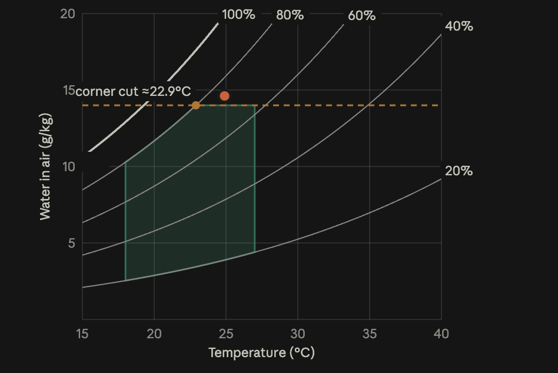

# Psychrometric SLA chart — ACE take-home

A small React + TypeScript app that draws a psychrometric chart by hand in SVG,
shades a data hall's SLA envelope, and plots the hall's live operating point
with a short trail, polling a (fake) readings API.

## How to run

```bash
npm install
npm run dev      # app at http://localhost:5173
npm test         # unit tests (Vitest)
npm run build    # type-check + production build
```

Tick "Simulate sensor outage" under the chart to see the failure state.

## Project structure

```
src/
  physics/psychrometrics.ts   the three formulas from the brief: (°C, RH%) -> g/kg
  sla/compliance.ts           decides inside/outside from the five numeric rules
  chart/scales.ts             data units -> pixels (hand-written linear scales)
  chart/geometry.ts           RH curves and the envelope outline, in data units
  chart/layers/               one component per visual layer
  chart/PsychroChart.tsx      creates the scales once and stacks the layers
  api/readingsApi.ts          fake polled API (latency, failures, moving window)
  hooks/useRecentReadings.ts  React Query polling
  components/SlaStatusBadge   status in words, including which rule broke
```

## Key decisions and trade-offs

Each decision below says what I chose, why, and what it costs.

### 1. The safe zone uses the lower of two limits as its top edge

- **Decision:** The SLA has three kinds of limits: temperature (°C), humidity (%)
  and a water cap (14 g/kg). The top edge of the green zone is whichever is
  lower at each temperature: the 80% humidity line or the 14 g/kg cap.
- **Why:** Above about 22.9 °C the 80% line goes higher than 14 g/kg, so the cap
  cuts off the top-right corner. Drawing only the °C and % limits would show a
  zone that is too big.
- **Trade-off:** Curves are drawn as many tiny straight lines (one every 0.1 °C),
  so the edge is a very close approximation, not a perfect curve.

### 2. Inside or outside is decided by the numbers, not the drawing

- **Decision:** A reading is checked against the five limits directly. The
  result lists every rule it broke, not just "pass" or "fail".
- **Why:** The numbers are exact, easy to test, and the screen can say _why_
  the hall is out, e.g. "Humidity ratio 14.6 g/kg (max 14)". This catches
  readings like 24.9 °C / 74%, which look fine on temperature and humidity but
  hold too much water.
- **Trade-off:** The drawing and the check are separate code, so they must
  agree. Tests cover both.

### 3. I wrote the scale maths myself instead of using d3

- **Decision:** Turning °C and g/kg into screen positions is done by a small
  function I can read in one go.
- **Why:** It's one line of maths, it keeps the project light, and nothing is
  hidden.
- **Trade-off:** No free extras like zooming or automatic tick marks. If the
  chart grew, I'd switch to d3-scale.

### 4. Each part of the chart is its own small component

- **Decision:** Axes, humidity lines, safe zone, trail, current point and
  tooltip are separate components. They all share one set of scales.
- **Why:** Each file does one job, and adding a second data hall means adding
  another point (and its own safe zone) without touching the rest So Following SOLID design pattern.
- **Trade-off:** More files to move between.

### 5. Every API call returns the last 30 minutes, not just the latest reading

- **Decision:** Each call returns the last 6 readings (5 minutes apart).
- **Why:** The trail is full as soon as the page opens, there are no duplicates,
  and after an outage the next good call fixes everything.
- **Trade-off:** It resends 6 readings each time. With much more data, I'd load
  the history once and then fetch only new readings.

### 6. When data stops arriving, the screen says "unknown", never green

- **Decision:** If a call fails, the last good data stays on screen, the point
  turns grey, and the status says "Status unknown". There are no automatic
  retries; the next poll 2 seconds later is the retry.
- **Why:** An old green dot during an outage would tell an operator everything
  is fine when nobody actually knows.
- **Trade-off:** Even a short blip shows "unknown". That's more alerts, but safer.

### 7. Inside or outside is shown by shape as well as colour

- **Decision:** Green circle = inside, red diamond = outside, hollow grey = unknown.
  The current point works with the keyboard as well as the mouse.
- **Why:** People who can't tell red from green can still read it.
- **Trade-off:** The older trail points only respond to the mouse for now.

### 8. I drew the chart in SVG, not Canvas

- **Decision:** Every part of the chart (curves, safe zone, trail, point,
  tooltip) is an SVG element that React renders like any other component.
- **Why:**
  - The chart only has a few dozen shapes, which SVG handles easily.
  - Each shape is a real element, so React can update just the point and trail
    when new data arrives. With Canvas I would have to clear and redraw the
    whole picture myself on every update.
  - The current point can take keyboard focus, have an `aria-label` and show
    the tooltip on hover or focus. Canvas is one flat image, so I would have to
    build all of that by hand.
  - SVG gives me useful tools for free: a clip path to cut the curves at the
    plot edge, and a `viewBox` so the chart scales to any screen size and stays
    sharp.
- **Trade-off:** SVG gets slow with thousands of shapes. If the chart had to
  show many halls or a long, dense history, I would draw the data points on a
  Canvas and keep SVG for the axes and labels.

### Shortcuts I took on purpose

- Real readings come every 5 minutes, but the app checks every 2 seconds so you
  can see the point move.
- The sample data loops back to the start when it ends, so the trail jumps once
  per loop.

## Tests

A small number, where mistakes are easy to make and hard to spot:

- **The humidity formula:** 25 °C at 60% should give about 11.87 g/kg. This
  catches the classic bug of forgetting to turn 60% into 0.6.
- **The safe zone:** its top edge never goes above 14 g/kg.
- **The SLA rules:** including readings that pass temperature and humidity but
  fail the water cap, and readings exactly on a limit (which count as inside).
- **The scales:** the chart is not drawn upside down.

## How I used AI assistants

I wrote the app code myself and used Claude (Anthropic) as a helper along the
way: to learn the domain, to get unstuck on specific problems, to write the
tests and the styling, and to review my work.

- **Learning the domain.** Psychrometrics was new to me, so I started by asking
  Claude to teach me: what humidity ratio means, how the three formulas connect,
  and how mixed-unit limits become a shape. Working through the numbers is how
  the cut-off corner and the 24.9 °C / 74% reading came up.
- **A quick prototype of the target.** Before writing any code, I worked with
  Claude on a rough sketch of how the chart should look: the RH curves, the
  green safe zone, the 14 g/kg cap cutting the top-right corner at about
  22.9 °C, and a reading (24.9 °C / 74%) that sits just above the cap. I used
  it as a picture to aim for while building the real chart.

  

- **Planning first.** Together we agreed the design and split the work into
  steps in a fixed order (formulas, scales, curves, safe zone, rules, data,
  states). That plan is in `CLAUDE.md`.
- **Writing the code.** I built each step myself and asked Claude for help in
  between when I needed it:
  - **The formulas file.** Claude helped me write `physics/psychrometrics.ts`,
    since it is just the three formulas from the brief turned into code.
  - **SVG questions.** I asked a lot about SVG when things were not working.
    For example, when I drew the RH curves, the lines kept going past the edge
    of the chart instead of disappearing there. Claude suggested a clip path,
    so the curves (and other data layers) are cut off at the plot area.
- **Tests.** I wrote the test cases with Claude. I decided what needed
  testing (the cases listed under [Tests](#tests)), Claude wrote the test
  code, and I ran them and checked each expected value made sense, for example
  working out the 25 °C / 60% humidity value by hand.
- **Styling.** The CSS (`styles.css`) was written by Claude.
- **Review.** Once the code was written, I asked Claude to review it. I then
  went through what it suggested myself and only kept the changes I understood
  and agreed with.
- **Checking it.** I ran the tests and the app locally and checked all three
  states (inside, outside, unknown). Then I went through every file, explaining
  it back and working the maths by hand.
- **What changed from the first plan:**
  - I used my own scale maths instead of d3-scale.
  - The plan had the fake API fail at random; I replaced that with a
    "simulate outage" switch, so the failure state can be shown on demand.
  - Each broken rule now carries its unit and whether it's a min or max, so the
    status can be written as a full sentence.

## Time spent

About 3.5 hours in total:

- **~1 hour learning the domain.** Reading about and understanding the physics
  and maths: what humidity ratio is, how the three formulas fit together, and
  how limits in °C, % and g/kg combine into one shape on the chart.
- **~2.5 hours building.** Writing the code (with Claude's help as described
  above), the tests, checking it in the browser, and getting it deployed.

To stay inside the time limit, I put the chart geometry and the SLA rules
first and kept visual polish light. The items under
[What I'd do next](#what-id-do-next) are the scope I cut on purpose.

## What I'd do next

1. **Warn before it breaks.** Add an amber "close to limit" state, so operators
   can act before the hall leaves the SLA, not after.
2. **Show where the hall is heading.** Use the trail's direction, or a model
   forecast, to show where the point will be in 15 to 30 minutes and how long
   until it would cross a limit.
3. **Show the effect of a cooling change.** Plot a second, "predicted" point
   for a recommended setting next to the current one, so an operator can see
   the expected result before accepting it.
4. **Many halls on one screen.** A hall selector, or several points on one chart,
   each with its own safe zone.
5. **Catch frozen sensors.** Today "unknown" only appears when a request fails.
   It should also appear when the API answers but the newest reading is too old.
6. **Longer history.** Let users switch the trail between 30 minutes, a few hours
   and a day, loading history once and fetching only new readings after that.
7. **Better accessibility and screen tests.** Make every trail point reachable by
   keyboard, improve screen reader announcements, and add tests for each screen
   state.
